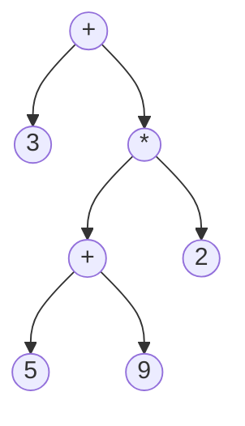

The idea of building a roman digit calculator and DSL language processor as the first project was interesting. For creating the calculator, we had developed a small scale Lexer, Parser, and Semantic Analyser. I was involved in processing the exponential operator, fabricating the syntax tree and semantic analysis. For building the syntax tree, I had made a binary expression tree using structs. The root node and all internal represent operators, and the leaf nodes represent operand; for example, the expression 3 + ( ( 5 + 9) * 2) is represented as:

The tree is generated based on the grammar. The tree's nodes are added dynamically during the parsing phase while moving down in the grammar hierarchy. The interesting point to note is that the inorder traversal of the tree would create the infix expression; similarly, postorder traversal would generate the postfix expression, and preorder traversal would generate the prefix expression.
The successful completion of the parsing phase generates the expression tree. Then this tree is used further in semantic analysis and finding out the result of the expression. The tree is traversed recursively so that every recursive call returns the answer of the smaller subproblem(subtree). The validity of each subexpression is checked against the predefined semantic rules, and accordingly, an error is printed to the console. After the tree traversal, we get the result, and the result is translated back to the Roman language and displayed on the console.

After working as a full-stack developer for more than two years, returning to academics was like a fresh breath of air. Learning and working with Golang was very enjoyable. Golang's syntax is very similar to C++, so it was a slight learning curve. Golang is comparatively a new language and is under constant development. Therefore, it lacks support for exception handling; to raise an exception, you are forced to return an error as an extra argument from a function and add extra if statements to handle it.

For building the DSL and SQL statements, NodeJs is being used. NodeJS natively supports serialization and deserialization of JSON objects through JSON.stringify() and JSON.parse() functions. We can also read JSON objects without parsing them. With the help of string interpolation DSL and SQL statements are generated. To depict a trade cancellation request, the SQL update statement is being used, and it is assumed that there would be a timestamp type column called `CancelledAt`; this approach would help us maintain a log of cancelled trade requests.

Overall, working on the project was a fun learning experience. I hope you would also have felt the same while reading through the experience :-).
