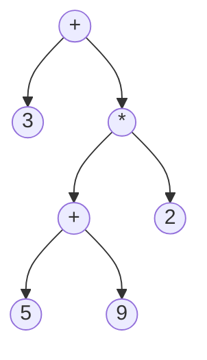

# Part 2
Please make sure you have ***NodeJs@v10.21.0*** installed in your system to run the code for part 2A and 2B.
<br>
<br>
## **Part 2A**
<br>

# Given Dsl Grammar:
```
<stock_trade_requests> →  ‘(' <trade> {‘,’ <trade>} ‘) for account' <acct_ident>’.’
<trade> → <number> <stock_symbol> ‘shares’ (‘buy at max' | ‘sell at min') <number>
<number> →  [1-9] {[0-9]}
<stock_symbol> →
 'AAPL'|'HP'|'IBM'|'AMZN'|'MSFT'|'GOOGL'|'INTC'|'CSCO'|'ORCL'|'QCOM'
<acct_ident> →  ‘“‘alpha_char { alpha_char | digit | ’_’} ‘“‘

```

## Given Json:
Sample json file is also provided under Part2A directory.
```json
{
    "user id": "Hokie123",
    "buy": [
        {
            "stock symbol": "IBM",
            "shares": 100,
            "at max": 45
        },
        {
            "stock symbol": "GOOGL",
            "shares": 50,
            "at max": 60
        },
        {
            "stock symbol": "AMZN",
            "shares": 120,
            "at max": 70
        }
    ],
    "sell": [
        {
            "stock symbol": "GOOGL",
            "shares": 20,
            "at min": 40
        },
        {
            "stock symbol": "ORCL",
            "shares": 30,
            "at min": 25
        }
    ],
}
```
## Given SQL
```sql
INSERT INTO BuyRequests (NumShares, Symbol, MaxPrice, AccountID)
		                               VALUES (‘100’, ‘IBM’, ‘45’,  ‘Hokie123’)

INSERT INTO SellRequests(NumShares, Symbol, MinPrice, AccountID)
				        VALUES(‘30’, ‘ORCL’, ‘25’, ‘Hokie123’)
```
## Running the program:
The program can be run using makefile. You need to change your directory to Part2A using `cd Part2A`. To run the program please use `make build` to install the dependencies and then `make json=JSONFILENAME.json run` to execute the program.

`make clean` would delete all the dependencies i.e., node_modules, and .dsl and .sql files present in the Part2A directory.
<br>
<br>


# **Part 2B**
<br>

## Given Dsl Grammar:
```
<stock_trade_requests> →  ‘(' <trade> {‘,’ <trade>} ‘) for account' <acct_ident>’.’
<trade> → <number> <stock_symbol> ‘shares’ (‘buy at max' | ‘sell at min') <number>
<number> →  [1-9] {[0-9]}
<stock_symbol> →
 'AAPL'|'HP'|'IBM'|'AMZN'|'MSFT'|'GOOGL'|'INTC'|'CSCO'|'ORCL'|'QCOM'
<acct_ident> →  ‘“‘alpha_char { alpha_char | digit | ’_’} ‘“‘
```
<br>

## Given Json:
Sample json file is also provided under Part2A folder.
```json
{
    "user id": "Hokie123",
    "buy": [
        {
            "stock symbol": "IBM",
            "shares": 100,
            "at max": 45
        },
        {
            "stock symbol": "GOOGL",
            "shares": 50,
            "at max": 60
        },
        {
            "stock symbol": "AMZN",
            "shares": 120,
            "at max": 70
        }
    ],
    "sell": [
        {
            "stock symbol": "GOOGL",
            "shares": 20,
            "at min": 40
        },
        {
            "stock symbol": "ORCL",
            "shares": 30,
            "at min": 25
        }
    ],
}
```

## Modified Grammar to Cancel Trades for given stock(s):
```
<stock_trade_requests> → ‘(' <trade> {‘,’ <trade>} ‘)  <account_substr> 
| 'Cancel' (<stock_symbol> {, <stock_symbol>}) 'trade' <account_substr>
<trade> → <number> <stock_symbol> ‘shares’ (‘buy at max' | ‘sell at min') <number>
<number> →  [1-9] {[0-9]}
<stock_symbol> →
 'AAPL'|'HP'|'IBM'|'AMZN'|'MSFT'|'GOOGL'|'INTC'|'CSCO'|'ORCL'|'QCOM'
<acct_ident> →  ‘“‘alpha_char { alpha_char | digit | ’_’} ‘“‘
<account_substr> -> for account' <acct_ident>’.’
```


## Modified JSON structure for to include cancel trade requests:
Sample json file is also provided under Part2B folder.
```json
{
    "user id": "Hokie123",
    "buy": [
        {
            "stock symbol": "IBM",
            "shares": 100,
            "at max": 45
        },
        {
            "stock symbol": "GOOGL",
            "shares": 50,
            "at max": 60
        },
        {
            "stock symbol": "AMZN",
            "shares": 120,
            "at max": 70
        }
    ],
    "sell": [
        {
            "stock symbol": "GOOGL",
            "shares": 20,
            "at min": 40
        },
        {
            "stock symbol": "ORCL",
            "shares": 30,
            "at min": 25
        }
    ],
    "cancel": [
        "GOOGL"
    ]
}

```

The `cancel` key in the above json object is an array containing stock symbol(s) for which trade is to be cancelled. We can cancel trade for more than one stock at a time.


## SQL Statement:
For cancelling the trade of the stocks `update` statement is being used and `CancelledAt` is set to the current time using `now()` sql(postgresql) function. It is assumed that there will a `CancelledAt` column in the database table which will be only populated when the trade has been cancelled. This would help us in keeping track when the trade was cancelled and for which stocks it was cancelled.


## Running the program:
The program can be run using makefile. You need to change your directory to Part2B using `cd Part2B`. To run the program please use `make build` to install the dependencies and then `make json=JSONFILENAME.json run` to execute the program.
`make clean` would delete all the dependencies i.e., node_modules, and .dsl and .sql files present in the Part2B directory.
`make filename=FILE_TO_DELETE delete` would delete the file.

<br>
<br>

# **Part 3**

Over the past few weeks a teammate and I have implemented a roman numeral calculator. This command-line program accepts arithmetic expressions containing roman numerals and either computes the result or gives an error - when the entered expression does not adhere to the proper format. Developing this program required the application of programming language compilation concepts like lexical analysis, syntax analysis, and semantic analysis. In this sense, I treated the “correct format” for roman numeral arithmetic expressions as a language - which I described and parsed using a formal grammar.

As a bit of background, I am a graduate computer science student, and I have studied grammars and parsing algorithms before, but developing this roman numeral calculator was still a tough challenge. First of all, I wrote this program using the Go programming language - which I have never used before. My experience with Go was overall positive. There are numerous resources for learning the language, and my prior experience with C and C++ helped escalate the learning process - as Go shares many syntactic similarities with C. One particular feature of Go that I enjoyed was the global variable grouping under the “Variable Declaration Block.” This allows for variable declarations to be grouped together into blocks for greater readability and code quality.

When tackling the roman numeral calculator problem, I started with the development of the lexer. The lexer is the part of a compiler that deals with tokenizing an input to prepare it for syntax analysis via the parser. This part was more straightforward than the parser element, but was still challenging because I had to keep in mind how the lexer would fit into the program at large - I had to consider the future functionality of the parser. I got the hang of Go while writing the lexer, and by the time I was implementing the parser I felt fairly comfortable with the new language. 

Before I was able to implement the parser, I needed to stop and construct a more comprehensive implementation design. This required the review of course material surrounding EBNF grammars and parsing algorithms. I spent a lot of time figuring out the right EBNF grammar to describe the language used in the roman numeral calculator. This involved significant trial and error - as intermediate drafts of the grammar contained left recursion and/or pairwise disjointness that needed to be removed to arrive at the final grammar. I would ultimately use this grammar as the basis for a sequence of recursive descent subprograms used to perform syntax analysis. In the end, this project was a fun challenge as it required a deep level of understanding of compiler concepts and grammars while falling under a unique historical theme with roman numerals and Latin prose.


The idea of building a roman digit calculator and DSL language processor as the first project was interesting. For creating the calculator, we had developed a small scale Lexer, Parser, and Semantic Analyser. I was involved in processing the exponential operator, fabricating the syntax tree and semantic analysis. For building the syntax tree, I had made a binary expression tree using structs. The root node and all internal represent operators, and the leaf nodes represent operand; for example, the expression 3 + ( ( 5 + 9) * 2) is represented as:


The tree is generated based on the grammar. The tree's nodes are added dynamically during the parsing phase while moving down in the grammar hierarchy. The interesting point to note is that the inorder traversal of the tree would create the infix expression; similarly, postorder traversal would generate the postfix expression, and preorder traversal would generate the prefix expression.
The successful completion of the parsing phase generates the expression tree. Then this tree is used further in semantic analysis and finding out the result of the expression. The tree is traversed recursively so that every recursive call returns the answer of the smaller subproblem(subtree). The validity of each subexpression is checked against the predefined semantic rules, and accordingly, an error is printed to the console. After the tree traversal, we get the result, and the result is translated back to the Roman language and displayed on the console.

After working as a full-stack developer for more than two years, returning to academics was like a fresh breath of air. Learning and working with Golang was very enjoyable. Golang's syntax is very similar to C++, so it was a slight learning curve. Golang is comparatively a new language and is under constant development. Therefore, it lacks support for exception handling; to raise an exception, you are forced to return an error as an extra argument from a function and add extra if statements to handle it.

For building the DSL and SQL statements, NodeJs is being used. NodeJS natively supports serialization and deserialization of JSON objects through JSON.stringify() and JSON.parse() functions. We can also read JSON objects without parsing them. With the help of string interpolation DSL and SQL statements are generated. To depict a trade cancellation request, the SQL update statement is being used, and it is assumed that there would be a timestamp type column called `CancelledAt`; this approach would help us maintain a log of cancelled trade requests.

Overall, working on the project was a fun learning experience. I hope you would also have felt the same while reading through the blog :-).


**_PS: Please check the blog.pdf file under Part3 for expression tree visualization._**